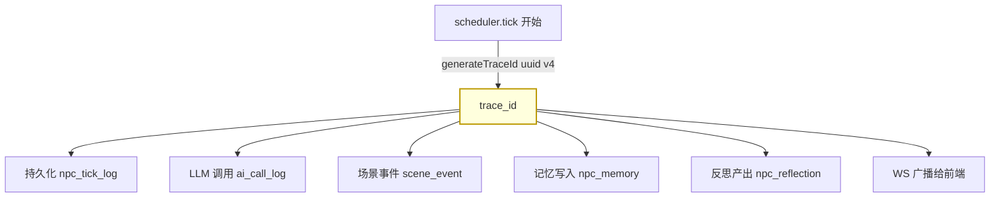
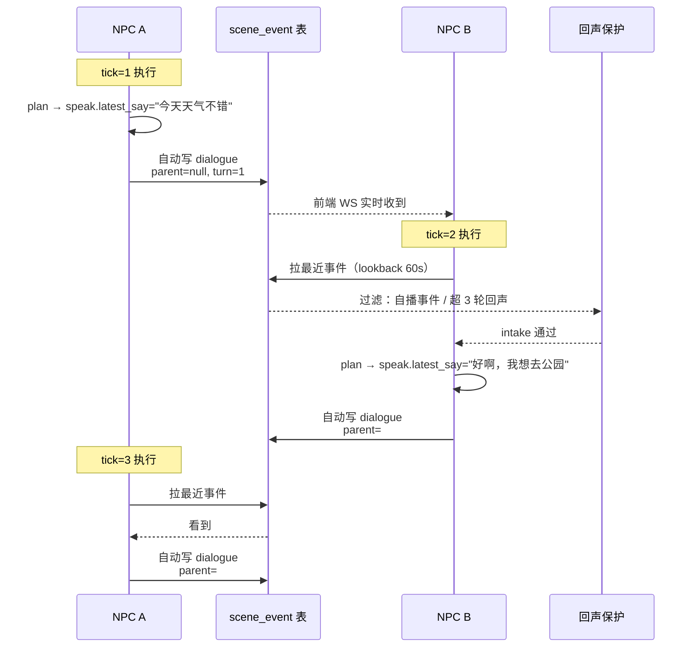

# M4.3 交付展示：让 NPC 开口对话，让系统记得每一步

> 版本 1.0 · 2026-04-23 · 关盘 tag `v0.4.3-closed`
> 详尽工程记录见 [`m4.3-summary.md`](./m4.3-summary.md)

---

## 一句话

**以前**：系统里每个 NPC 是孤岛，出了问题只能靠时间戳拼日志。
**现在**：每个 tick 一个 `trace_id` 串起 5 张表，NPC 开始**互相搭话**，前端看得见"谁在回应谁、回到了第几轮"。

---

## 看得见的变化

### 1. NPC 会搭话了

之前 NPC A 说一句话，NPC B 下一 tick **压根听不到**（只能看 `neighbors` 名字列表）。
现在 A 一说话，系统自动把这句话写成"场景对话事件"，B 在下一 tick 的推理输入里就能看到并回应。

```
[tick=1] 小明：今天天气不错，要不要出去走走？
[tick=2] 小美：好啊，我正好想去公园。   ← ↩ 回复 #1 · T2
[tick=3] 小明：那我们去东边那个新开的吧？  ← ↩ 回复 #2 · T3
```

### 2. 不会卡死在无限循环里

两个 NPC 互相搭话时最怕"你一句我一句停不下来"。
系统有**硬上限保护**：同一组人最多 **3 轮**来回，超过就主动拦截，写一条 warn 日志，让 NPC 自己切话题或闭嘴。

### 3. 前端两个小细节

- **事件抽屉**里，对话卡片头部多了一个 `↩ 回复 #id·T2` 徽章，鼠标悬停看完整回复链信息
- **沙盒画面**里 NPC 头顶气泡，如果这句话是回复别人的，下方多一行 `💬 回应 小明`

两处都是**复用原有组件**，零新 UI、零新依赖。

### 4. 问题排查有了"时间线"

以前查"某次 tick 为什么卡了"要翻 5 张表 JOIN。
现在一个接口搞定：

```http
GET /api/engine/trace/<trace_id>
```

返回这个 tick 在 **LLM 调用记录、NPC tick 日志、场景事件、NPC 记忆、反思** 5 张表里的全部足迹，含计数摘要与最近 20~50 条明细。

---

## 架构（2 张图）

### trace_id 怎么贯穿一次 tick



**要点**：一次 tick 只生成**一个** `trace_id`，沿函数调用链**显式参数**传下去（不用全局上下文，便于单测），5 张表 + WS 全部带上这个 id。

### NPC 之间怎么"听见"对方



**要点**：
- 对话链用 `parent_event_id` + `conv_turn` 建模，**不新建会话表**
- 自动化：`speak.latest_say` 非空就自动转 `scene_event`，无需额外 LLM 语义判断
- 回声保护作用在**事件进入 NPC 视野之前**，链自然断掉，不会再产生回应

---

## 核心交付

| 面向 | 能力 | 状态 |
|---|---|---|
| **用户** | NPC 会自动对话 | ✅ |
| **用户** | 前端可视化回复链（抽屉徽章 + 气泡后缀） | ✅ |
| **运维** | 一键按 `trace_id` 聚合整 tick 日志 | ✅ |
| **运维** | 对话回声硬上限（可动态回退到 0 关闭） | ✅ |
| **架构** | 5 张主表 + WS 全部带 `trace_id` | ✅ |
| **架构** | 迁移脚本幂等（可重复跑） | ✅ |

### 规模

- **数据层**：7 个字段扩列、6 个索引、零新表
- **配置**：6 个新环境变量，**全部可通过开关回退到 M4.2 行为**
- **接口**：1 个新 REST（`GET /api/engine/trace/:id`）、0 个新 WS 事件（字段透传复用）
- **前端**：0 个新组件、0 个新依赖、bundle 增量 < 5 KB

### 一键回退通道

| 开关 | 效果 |
|---|---|
| `TRACE_ID_ENABLED=false` | `trace_id` 字段全 NULL，行为 = M4.2 |
| `DIALOGUE_AUTO_EVENT_ENABLED=false` | 关闭自动对话注入（NPC 仍会说话但不互相感知） |
| `DIALOGUE_ECHO_MAX_TURN=0` | 关闭回声保护（排障用） |

---

## 体验路径

```bash
# 1. 起后端（自动跑 M4.3 迁移）
cd backend && npm run db:migrate:m43 && npm run dev

# 2. 起前端
cd frontend && npm run dev

# 3. 打开 http://localhost:5173 进入沙盒场景
#    - 让 scheduler 跑几个 tick
#    - 看 NPC 头顶气泡出现「💬 回应 小明」
#    - 打开 📢 事件抽屉，看 dialogue 卡片 header 的「↩ 回复 #id·T2」

# 4. 拷贝控制台 WS 日志里的 trace_id，查整条链路：
curl http://localhost:3000/api/engine/trace/<trace_id>
```

---

## 已知限制

仍受测试环境规模限制的两点，已规划到 M4.4：

1. **对话窗口**：默认 `EVENT_LOOKBACK_SECONDS=60` 秒，若两轮 tick 间隔拉长（预算 skip 等）会导致链断。M4.4 拟调大或改为按条数而非时间窗口。
2. **前端 ring 容量**：`💬 回应` 后缀依赖本地 ring buffer（200 条）回溯 parent，超出窗口的老对话不会显示后缀（但 `↩ 回复` 徽章仍在）。

---

## 下一步（M4.4 规划入口）

三条候选主线，按 roadmap v1.0 §14.3：

1. **Lookback 治理**（解决对话链断裂）
2. **Sandbox.vue 组件拆分**（M4.2 延后项）
3. **NPC 日程 / 长期规划**

关盘 tag：`v0.4.3-closed`。

---

**M4.3 交付结束。从这一版开始，NPC 有了会话能力，系统有了"时间线"。**
