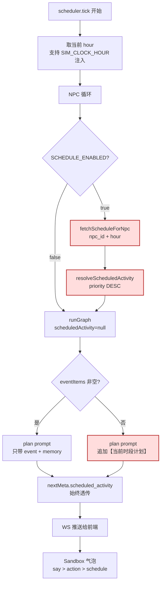
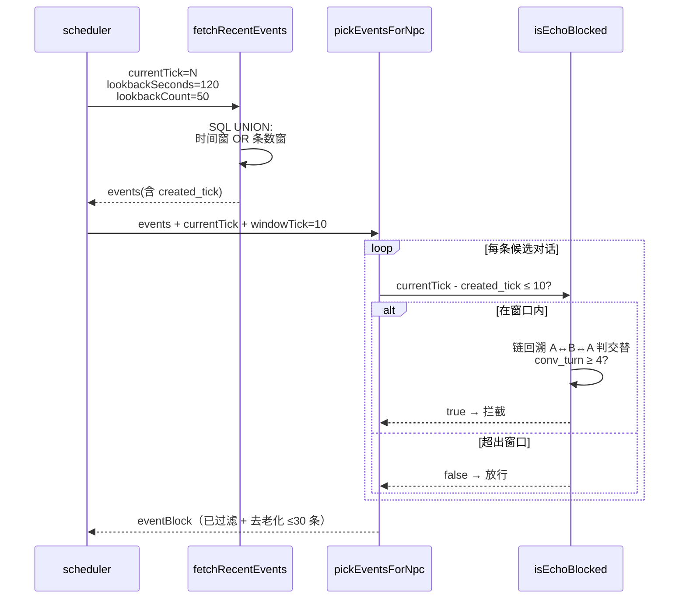

# M4.4 交付展示：让 NPC 有日程，让对话续得上

> 版本 1.0 · 2026-04-23 · 关盘 tag `v0.4.4-closed`
> 详尽工程记录见 [`m4.4-summary.md`](./m4.4-summary.md)

---

## 一句话

**以前**：NPC 纯靠"刚发生了什么"反应，聊两句就容易卡壳；闲着的时候头顶气泡一片空白。
**现在**：NPC **自带 24 小时日程表**——闲时按日程生活，被搭话时照常回应；对话链能跨更久不断档，超长回声不再反复拦截同一轮。

---

## 看得见的变化

### 1. NPC 闲下来也有事做

没有新事件时，NPC 不再"站在原地发呆"——plan 节点会从数据库里读当前小时的日程条目，告诉 LLM：

```
【当前时段计划】工作 at 书房（请据此展开当前 tick 的 1-3 步计划）
```

于是 NPC 会自然说出「我先去书房看会儿资料」、「早饭时间了，去厨房」这样带时间感的话。

### 2. 沙盒气泡不再空白

- NPC 刚说了话 → 气泡展示 `💬 说："……"`（M3.2 已有）
- NPC 没说话但在动 → 气泡展示 `🚶 动作：……`（M3.2 已有）
- NPC 闲着没事 → **新**气泡展示 `📅 当前日程: 工作 @ 书房`

```
早上 10 点：📅 当前日程: 工作 @ 书房
中午 12 点：📅 当前日程: 午餐 @ 厨房
晚上 7 点：📅 当前日程: 休闲 @ 客厅
```

### 3. 对话链能续更久了

M4.3 的对话链最怕"budget skip"——两个 tick 间隔超过 60 秒就拉断了。
M4.4 改成**混合窗口**：时间窗（120s）∪ 条数窗（最近 50 条），只要任一条件满足就能挂上 parent。

```
tick=1 (10:00:00) 小明：要不要一起吃午饭？
tick=2 skip (预算耗尽)
tick=3 skip (预算耗尽)
tick=4 (10:02:30) 小美：好啊，我在客厅等你。   ← ↩ 回复 #1 · T2  ← 150s 前也能挂上
```

### 4. 回声保护更精准

之前只能"隐式"按事件顺序截断，偶尔会误杀间隔很久的正常回应。
现在改成**按 tick 差精确判断**：在 10 个 tick 窗口内最多 3 轮来回，超窗自动放行。

### 5. 日程可热切换

修改 `npc_schedule` 表后**下一 tick 立即生效**，无需重启服务：

```sql
-- 让小明 14:00 改去图书馆
UPDATE npc_schedule
SET activity='阅读', location='图书馆', priority=8
WHERE npc_id=1 AND hour=14;
```

---

## 架构（2 张图）

### NPC 日程如何驱动 plan 节点



**要点**：
- 日程是 **tick 级预解析**（scheduler 统一取 hour，NPC 循环内按需查表），不走 LLM 识别
- plan 节点**前置分支**：有事件就专心响应，没事件才顺着日程走（Q4=a 设计）
- `nextMeta.scheduled_activity` 始终透传，即便被事件分支抑制，前端气泡依然能用作回退

### 对话链混合窗口 + tick echo



**要点**：
- 混合窗口 `UNION DISTINCT` 一条 SQL 搞定，不引入应用层合并
- Echo 窗口从"隐式"升级为"显式 tick 差"，**回退通道**：`DIALOGUE_ECHO_WINDOW_TICK=0` 降回 M4.3 行为
- `EVENT_MAX_BLOCK_ITEMS=30` 给 intake 二次去老化，避免老事件把 prompt 撑爆

---

## 核心交付

| 面向 | 能力 | 状态 |
|---|---|---|
| **用户** | NPC 闲时按日程自主生活 | ✅ |
| **用户** | 沙盒气泡闲时不再空白（📅 回退） | ✅ |
| **用户** | 对话链不因预算 skip 拉断 | ✅ |
| **运维** | 日程可在线 UPDATE，下一 tick 生效 | ✅ |
| **运维** | 回声窗口可按 tick 差精确配置 | ✅ |
| **架构** | 新表仅 1 张（`npc_schedule`） | ✅ |
| **架构** | LangGraph.js 本节点暂不引入（Q5=a） | ✅ |

### 规模

- **数据层**：1 张新表 + 1 个扩列 + 1 个幂等迁移（跑 2 次结果一致）
- **配置**：6 个新环境变量，3 个完整回退开关
- **接口**：0 个新 REST、0 个新 WS 事件（继续复用 M4.3 通道）
- **前端**：0 个新组件、0 个新依赖，只给 `extractBubbleText` 加一个可选参数
- **单测**：后端 180 → **205**（+25）、前端 15 → **18**（+3）

### 一键回退通道

| 开关 | 效果 |
|---|---|
| `SCHEDULE_ENABLED=false` | 不查日程表，plan 回 M4.4.0 行为（等价 M4.3 纯响应式） |
| `EVENT_LOOKBACK_COUNT=0` | 条数窗关闭，回 M4.3 纯时间窗行为 |
| `DIALOGUE_ECHO_WINDOW_TICK=0` | 禁用 tick 差判拦，echo 回 M4.3 隐式窗口 |

---

## 体验路径

```bash
# 1. 起后端（自动跑 M4.4 迁移：scene_event.created_tick + npc_schedule 建表 + seed）
cd backend && npm run db:migrate:m44 && npm run dev

# 2. 起前端
cd frontend && npm run dev

# 3. 打开 http://localhost:5173 进入沙盒场景
#    - 让 scheduler 跑几个 tick
#    - 观察 NPC 头顶气泡：有对话时 💬，没事时 📅 当前日程: <活动> @ <地点>

# 4. 让 NPC "穿越到晚上"看行为变化（不用等真实钟表）
#    在 backend/.env 加一行：SIM_CLOCK_HOUR=22
#    重启后端，NPC 会进入"休闲/就寝"语境

# 5. 修改日程热切换（无需重启）
mysql> UPDATE npc_schedule
          SET activity='阅读', location='图书馆'
        WHERE npc_id=1 AND hour=15;
#    下一 tick 小明的 plan prompt 就会带上「【当前时段计划】阅读 at 图书馆」
```

---

## 默认日程模板（seed 开箱即用）

2 个种子 NPC × 24 小时 = 48 条基线条目，分段如下：

| 时段 | 活动 | 地点 | 说明 |
|---|---|---|---|
| 00:00 – 05:59 | 睡眠 | 卧室 | 深夜 |
| 06:00 – 07:59 | 早餐 | 厨房 | 起床后 |
| 08:00 – 11:59 | 工作 | 书房 | 上午 |
| 12:00 – 12:59 | 午餐 | 厨房 | 中午 |
| 13:00 – 17:59 | 工作 | 书房 | 下午 |
| 18:00 – 18:59 | 晚餐 | 厨房 | 傍晚 |
| 19:00 – 22:59 | 休闲 | 客厅 | 晚间社交 |
| 23:00 – 23:59 | 就寝 | 卧室 | 深夜前 |

所有条目 `priority=5`，可按需拉到 1-10 任意档位。

---

## 已知限制

仍规划到 M4.5 的几点（详见 `m4.4-summary.md §7`）：

1. **记忆无时间感**：`scheduled_activity` 目前只驱动 plan，未进 memory summary（NPC 记不住"昨天 10 点干了什么"）。
2. **无动态日程覆盖**：今天临时有访客的剧情化插入，需要 M4.5 的动态目标系统。
3. **整点硬切换**：10:59 → 11:00 可能带对话风格突变，未做 15 分钟 soft window 插值。
4. **LLM hint 通道未启用**：`SCHEDULE_LLM_HINT=true` 的并行注入方式（作 user 消息 hint）预留但未消费。

---

## 下一步（M4.5 规划入口）

三条候选主线（roadmap v1.0 §9.3）：

1. **动态目标系统**（临时事件覆盖日程 / 目标驱动行为）
2. **Sandbox.vue 组件拆分**（M4.2 → M4.4 连续延后项）
3. **P95 观测面板**（M4.2 X-1 延后项）

关盘 tag：`v0.4.4-closed`。

---

**M4.4 交付结束。从这一版开始，NPC 有了"昼夜节律"，对话有了"跨 tick 记忆"。**
